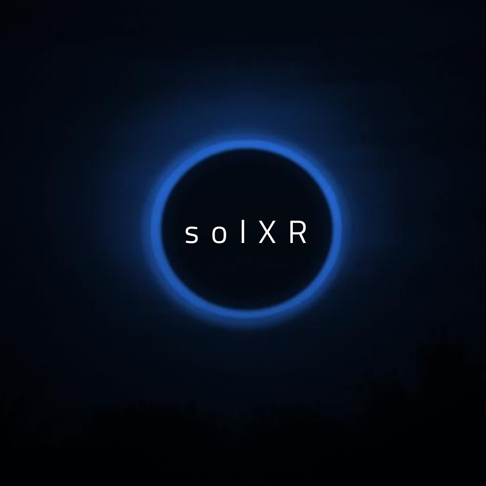

# solXR



## Project Overview

SolXR is an educational IOS application aimed at guiding users through the wonders of our Solar System. The app offers a multi-faceted AR experience, as well as several non-AR educational features. 


## How to Use solXR

- Download from the app store. 
- The first page you see will require you to login with an apple account.
- You will be brought to the homescreen, which features a new Astronomy picture every day. You can favorite these to save them for later.
- Navigate the app using the bottom tab. To access different features within a tab, use the top toolbar.  
- The learn screen is dedicated to two educational features, including a simple informational journey through the solar system as well as a dynamic timeline of the history of manned spaceflight. 
-  The experience screen details three distinct augmented reality features, each requires access to the user's camera. Two of the features include models of the sun, moon and eight planets of the solar system, and the third offers portals into 360º views of fun space stuff!
- The events screen dynamically renders upcoming astral events
- The settings screen controls things like music, accessibility features, email subscription services and logging out of the app. Press "save settings" for your preferences to persist across devices!


## Tech Stack 

1. MYSQL/Sequelize
2. Express Server 
3. React Native
4. NodeJS
5. Apple Authentication
6. ViroReact
7. Metro 

## APIs

1. NASA Astronomy Picture of the Day [NASA Image of the Day](https://apod.nasa.gov/apod/lib/about_apod.html) 


## Project Setup

This section will discuss what is needed to get the project up and running on your local machine.

### What to Add to Your .env

1. NASA Astronomy Image of the Day API Key [NASA Image of the Day](https://apod.nasa.gov/apod/lib/about_apod.html)

### Scripts to Run

```
npm install - to install all dependencies
```
```
cd ios/
```
```
pod install - generates the podlock file for ios builds
```
```
react-native link - links react to your native dependencies 
```
```
npm run ios - starts up an ios simulator on your local machine
```

## Launch Server/Initialize Database

Create a virtual machine to act as a server/database for the app client. 

- install node/git

- install mysql/sequelize

- import project into virtual machine
    - cd server
    - cd db
    - node seed.js
    - npm start 
